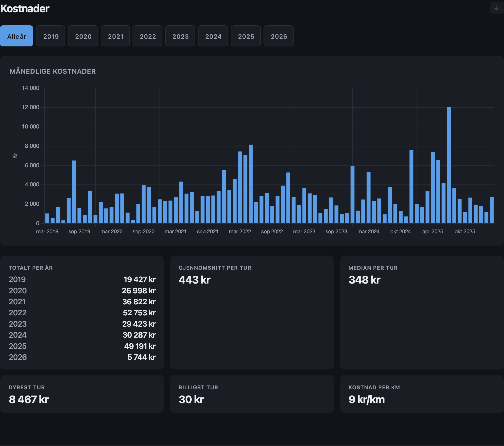
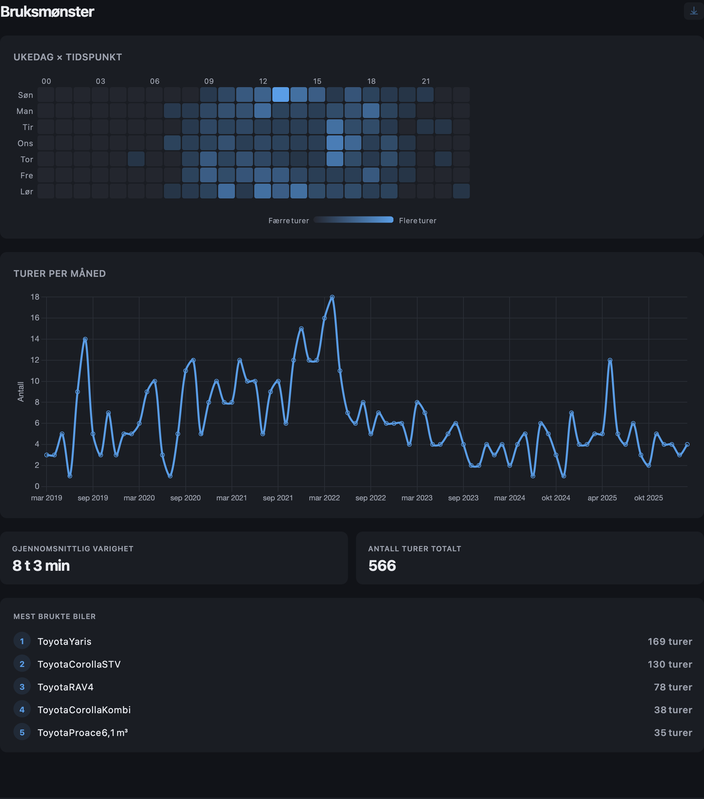
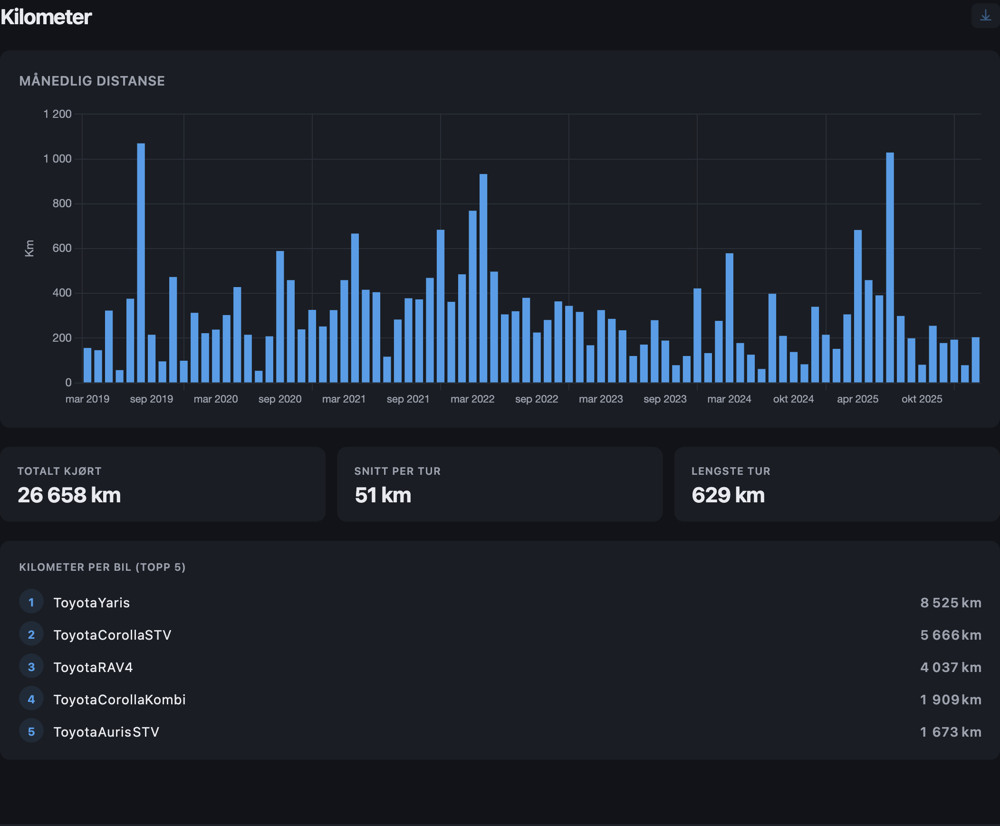
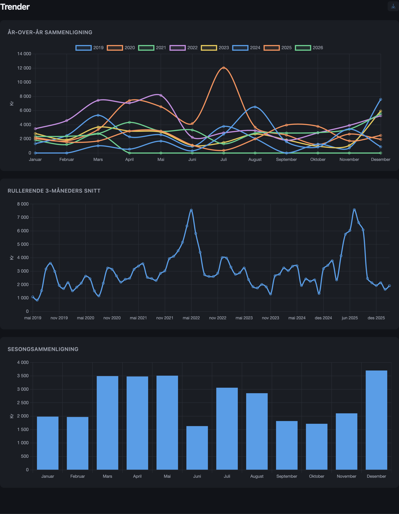
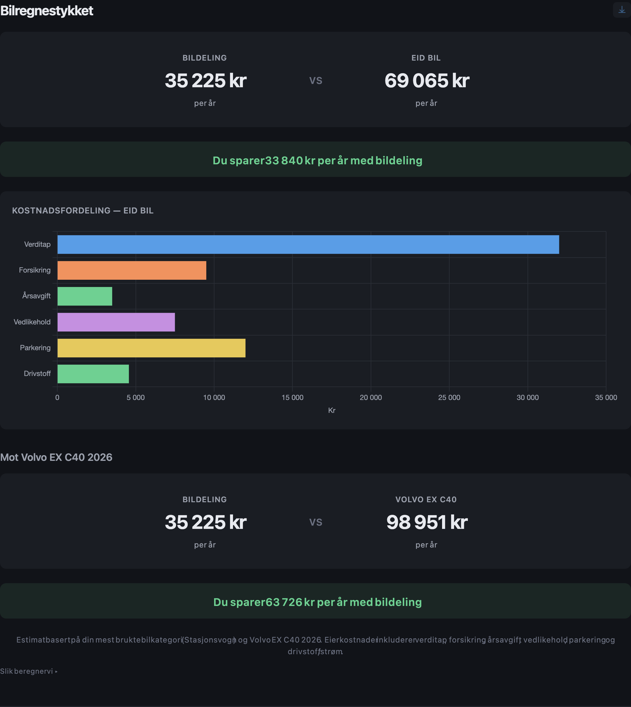
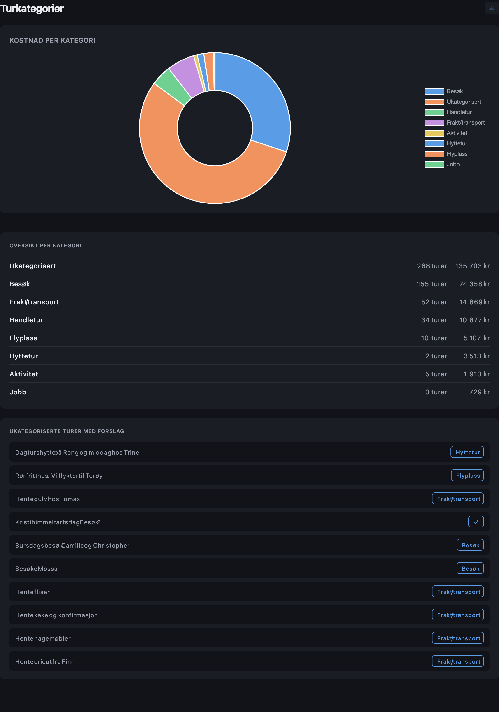
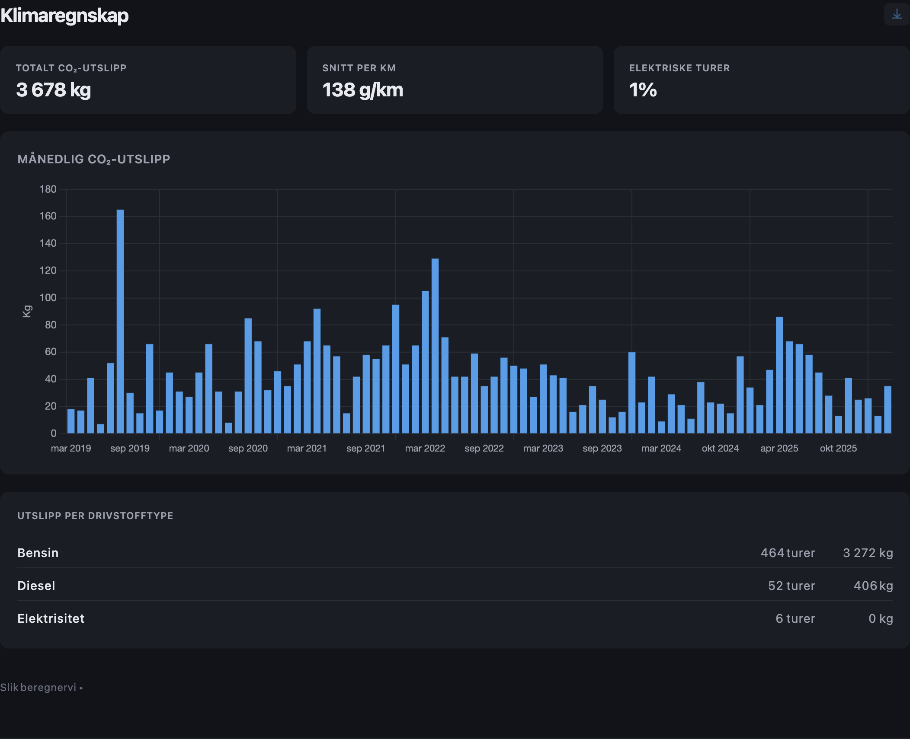
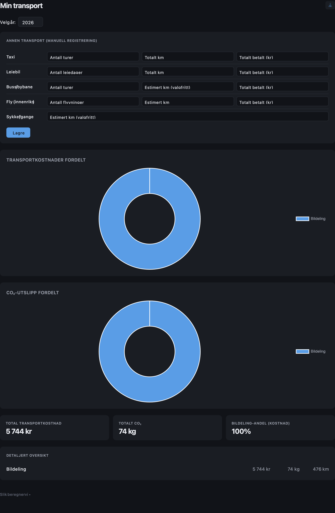

# Bildeleringen Stats

Nettleserutvidelse som gir deg oversikt over ditt bildeleforbruk, transportkostnader og klimaavtrykk. For medlemmer av [Bildeleringen / dele.no](https://dele.no).

## Skjermbilder

### Kostnader

### Bruksmønster

### Kilometer

### Trender

### Bilregnestykket

### Turkategorier

### Klimaregnskap

### Transportkalkulator

## Funksjoner

- **Popup** — månedlig forbruk, snittpris, mest brukte bil, besparelse og CO₂
- **Dashboard** — fullstendig statistikk med grafer:
  - Kostnader (måned, år, per tur, per km)
  - Bruksmønster (heatmap, turer per måned, mest brukte biler)
  - Kilometer (distanse, per bil, lengste tur)
  - Trender (år-over-år, rullerende snitt, sesong)
  - Bilregnestykket (bildeling vs. bileierskap, inkl. Volvo EX C40 2026)
  - Turkategorier (auto-kategorisering fra turnotater)
  - Klimaregnskap (CO₂ per drivstofftype og bil)
  - Transportkalkulator (taxi, leiebil, buss, fly, sykkel — totalbilde)
- **Årsoppsummering** — visuell "year in review"
- **PNG-eksport** av hver seksjon

All data forblir i nettleseren. Ingen eksterne servere, ingen sporing.

## Installasjon

Last ned `.zip` fra [Releases](../../releases).

**Firefox:**
1. Gå til `about:debugging#/runtime/this-firefox`
2. Klikk «Last inn midlertidig tillegg...»
3. Velg `.zip`-filen

**Chrome:**
1. Pakk ut zip-filen
2. Gå til `chrome://extensions` → Utviklermodus
3. Klikk «Last inn upakket» → velg mappen

Du må være innlogget på [app.dele.no](https://app.dele.no). Første synk tar 1–2 minutter.

## Personvern

All data lagres lokalt i nettleseren din. Eneste nettverkstrafikk er API-kall til dele.no med din eksisterende innlogging. Ingen tredjeparter.

## Estimater

Eierkostnader og CO₂ er estimater basert på norske kilder (NAF, Miljødirektoratet, TØI). Klikk «Slik beregner vi» i dashboardet for utregning og kilder.

## Utvikling

Se [docs/DEVELOPMENT.md](docs/DEVELOPMENT.md) for prosjektstruktur, teknologi og hvordan bidra.

## Lisens

[MIT](LICENSE)
